# Voice Rewriter

> **Right-click any text on the web. Rewrite it in your own voice. Watch it stream in.**
> A Chrome extension that doesn't sound like an LLM.

<p align="center">
  <a href="#install"></a>
  <a href="LICENSE"></a>
  
  
  <a href="#contributing"></a>
</p>

<p align="center">
  
</p>

---

## Why this exists

Most "AI rewrite" tools hand back text that anyone can clock in three seconds. Em-dashes everywhere, "delve", "leverage", "in today's fast-paced world", a tidy three-part summary at the end. You sound like ChatGPT, not you.

Voice Rewriter is built around two ideas:

1. **A voice profile that mimics how you actually write.** Paste a description or a sample once; every rewrite respects your rhythm, vocabulary, and quirks.
2. **Anti-AI guardrails in the system prompt.** Bans the obvious tells. Editable.

Select text → right-click → **Rewrite** → pick an action. The result streams into a popover. **Enter** to accept, **Esc** to discard.

---

## Features

- **Six rewrite actions** out of the box: Refine, Formalize, Elaborate, Shorten, Make casual, Fix grammar. Every prompt is editable.
- **Streaming preview** — chunks render live in a Shadow-DOM popover anchored to your selection.
- **Native undo** — Accept uses `execCommand('insertText')` so Ctrl/Cmd-Z reverts the rewrite cleanly.
- **Works wherever you type** — `<input>`, `<textarea>`, contenteditable. Gmail, Notion, Linear, Slack, X/Twitter, GitHub, your CMS, your dashboard.
- **Backend-agnostic** — Vercel AI Gateway, OpenRouter, or any OpenAI-compatible `/v1/chat/completions` endpoint with SSE.
- **Voice profile** — free-text. Describe yourself, paste samples, or both.
- **Anti-AI guardrails** — toggleable rule set baked into the system prompt.
- **Local-only key storage** — `chrome.storage.local`, never synced. Calls go browser → gateway. The extension has no server.
- **Onboarding wizard** that includes a built-in *Test connection* button so you find out you typed your key wrong **before** you try to use it on a real page.

---

## Install

> Not on the Chrome Web Store yet. Load it unpacked:

```bash
git clone https://github.com/rohitag13/re-writer.git
cd voice-rewriter
```

1. Open `chrome://extensions`.
2. Toggle **Developer mode** (top-right).
3. **Load unpacked** → select the cloned directory.
4. The onboarding tab opens automatically. Pick a provider, paste a key, write a voice profile (or skip), done.

### Where to get a key

| Provider                              | Get a key                                                  | Default model                  |
| ------------------------------------- | ---------------------------------------------------------- | ------------------------------ |
| **Vercel AI Gateway** *(default)*     | https://vercel.com/dashboard/ai-gateway/api-keys           | `anthropic/claude-sonnet-4`    |
| **OpenRouter**                        | https://openrouter.ai/keys                                 | `anthropic/claude-sonnet-4`    |
| **Custom OpenAI-compatible**          | Any endpoint with `/v1/chat/completions` + SSE streaming   | (you provide it)               |

Both Vercel AI Gateway and OpenRouter route a single key to hundreds of models with `provider/model` slugs. You don't need to manage Anthropic + OpenAI + Google keys separately.

---

## Use

1. Select text anywhere on the web.
2. Right-click → **Rewrite** → pick an action.
3. The popover streams the rewrite in real time.
4. **Enter** to accept and replace. **Esc** to discard. **Retry** to regenerate.

Cmd/Ctrl-Z undoes the rewrite — like any other edit.

---

## How it works

For the full deep-dive (selection capture timing, the port-based streaming protocol, SSE parsing, the Shadow-DOM popover, why the system prompt is structured the way it is), see [`docs/architecture.md`](docs/architecture.md).

```
   selected text
        │
        ▼
 contextmenu (background.js)
        │
        ▼  chrome.runtime.connect("rewrite-stream")
 long-lived port  ◀───────────────── content.js (Shadow-DOM popover)
        │                                       ▲
        ▼                                       │
 fetch(provider/v1/chat/completions, stream:true)
        │                                       │
        ▼                                       │
 SSE delta chunks ───── port.postMessage ───────┘
        │
        ▼
 Accept → execCommand('insertText') in the original input/contenteditable
```

- **Service worker** owns LLM calls, parses SSE, writes deltas to the port.
- **Content script** owns selection tracking and replacement. The Shadow-DOM popover keeps its CSS isolated from the host page.
- **Abort** is wired through `AbortController` — Esc/Discard/disconnect cancels the fetch.

---

## Configure

Open the options page (extension icon → **Settings** in the toolbar, or `Rewrite → Settings…` in the right-click menu).

- **Provider / model / API key / temperature**
- **Voice profile** — plain text. Description, samples, or both.
- **Anti-AI guardrails toggle**
- **Action prompts** — edit any of the six prompts inline. *Reset to defaults* restores them.
- **Re-run onboarding** — opens the wizard again.

### The anti-AI rule set (defaults)

> Avoid these tells: *delve, leverage, navigate, tapestry, in conclusion, moreover, furthermore, it's important to note, in today's fast-paced world, embark on a journey, game-changer, robust, seamless.*
> No em-dash overuse. No "not X, but Y" pattern. No stacked tricolons unless the original had them. No "Sure," / "Here is," openers. No summary endings. Vary sentence length. Keep the user's contractions and informality.

You can edit the live prompt by changing the `buildSystemPrompt` function in `background.js`, or extend it through the action prompts in settings.

---

## Privacy

- Your API key is stored in `chrome.storage.local` **on this device only**. It is never synced.
- Your text travels from your browser **directly** to the gateway endpoint you configured. The extension has **no server of its own** and no telemetry.
- The extension declares `<all_urls>` so right-click rewrite works on every site, and so the streaming fetch to gateway endpoints isn't blocked.
- Source is small and readable — about 700 lines of vanilla JS. Audit it.

---

## Project layout

```
manifest.json            Manifest V3
background.js            service worker — context menus + port-based streaming
content.js               selection tracking + Shadow-DOM preview popover + replacement
defaults.js              shared constants (actions, prompts, providers)
options.html/.css/.js    settings page
onboarding.html/.css/.js first-run wizard
.github/                 issue + PR templates, CI workflow
```

No build step. No bundler. No dependencies at runtime. Edit a file, reload the extension, ship.

---

## Roadmap

- [ ] User-defined custom actions (your own buttons in the right-click menu)
- [ ] Per-site voice overrides (Slack ≠ LinkedIn ≠ commit messages)
- [ ] Diff view in the preview popover (inline before/after highlighting)
- [ ] Keyboard shortcut to repeat the last action
- [ ] Firefox + Safari ports (Manifest V3 is portable, mostly UI tweaks)
- [ ] Chrome Web Store listing

Have a feature you want? [Open an issue](../../issues/new/choose).

---

## Contributing

Pull requests welcome. See [CONTRIBUTING.md](CONTRIBUTING.md). The codebase is intentionally small and dependency-free — easy to read, easy to fork, easy to PR.

---

## License

[MIT](LICENSE) — do whatever you want, just keep the notice.

---

## Credits

- [Vercel AI Gateway](https://vercel.com/ai-gateway) and [OpenRouter](https://openrouter.ai) for solving the "one key, many models" problem.
- Anyone who has ever read an AI-generated paragraph and thought *"this person is not real."* That feeling is the whole reason this exists.
